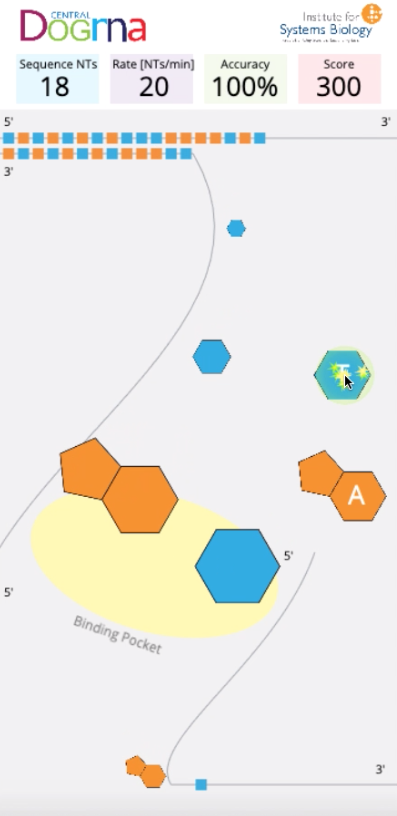

# Central Dogma Game - Building happy pairs for happy students



## Description

Learn the essentials of Central Dogma by playing a quick game. See who can make the pairs the fastest,
while maintaining accuracy.

## Play Now!

The game is currently hosted on Github for the time being. http://baliga-lab.github.io/central-dogma-game/central-dogma.html
However, the game will be moved onto proper Systems Biology infrastructure soon.

## Main Source

The entryway for the main codebase begins at [main.js](static/js/main.js). This file also houses the basic configuration
for the individual levels.

### Programming Levels

Levels are defined in the main JavaScript file. They are contained in a JSON list with the levels in order. A sample level
for the nucleotides level may look something like this.
```json
{
    "ntSequence": "ATATTTTAAATATATATATA",
    "controls": ["T", "A"],
    "unlocked": true,
    "name": "AT the Beginning",
    "speed": 20,
    "popups": {
        "firstCorrectMatch": "Good work! <style='color: {{ nucleotide1.color }};'>{{ nucleotide1.name }}</style> binds with <style='color: {{ nucleotide2.color }};'>{{ nucleotide2.name }}</style>!",
        "error5Match": "In DNA <style='color: {{ nucleotide1.color }};'>{{ nucleotide1.name }}</style> can only bind to <style='color: {{ nucleotide2.color }};'>{{ nucleotide2.name }}</style>, both nucleotides help make up DNA!"
    },
    "rotateNT": false,
    "ntType": "basic",
    "lvlType": "dna_replication",
}
```

Here is a reference of what kind of properties each level can contain.
| Property | Description |
| --- | --- |
| ntSequence | Sequence of nucleotides that the level should provide for the player. They are the incoming nucleotides. For codons level, the length of the sequence must be divisible by 3. |
| controls | A list of nucleotides that should be given to the players to choose from. They are not applicable to the `codon_transcription` level type as they are just being randomized anyways. |
| unlocked | Should the level be playable? |
| name | The name of the level. Should be clever and punny. |
| speed | How much delay in milliseconds there should be before the game ticks by a step. The smaller the number, the faster the tick, thus a quicker pace. |
| popups | What should the player be informed on during gameplay? Contains a javascript object with type of popup mapped to the popup text. Use `<style>` to style the popup text. Use mustache templates `{{ }}` to have the game fill in dynamic details. |
| rotateNT | If the nucleotide buttons should be able to be rotated into the correct position before submitting. |
| ntType | The level of details for the nucleotides that players see. Choose from `basic`, `hbonds`, or `backbone`. |
| lvlType | The type of level that the game should souce from. `dna_replication` or `codon_transcription` |

#### Popups

There are multiple popups variations to choose from. You may assign one popup variation each per level.
| Popup Variation | Behavior | Template Parameters |
| --- | --- | --- |
| firstCorrectMatch | When the player makes a first correct match, compliment them with something! | nucleotide1 & nucleotide2 -> the two nucleotides that the player has made |
| errorMatch | When the player makes an incorrect match, inform them. | nucleotide1 & nucleotide2 -> the two nucleotides that the player has made |
| error5Match | On every 5 incorrect matches made, show this popup. | nucleotide1 & nucleotide2 -> the two nucleotides that the player has made |

##### Templates Object

Of course, knowing what the templates contain would be important to designing a bold popup.

###### Nucleotide

| Property | Description | Example |
| --- | --- | --- |
| name | The name of the nucleotide | Thymine |
| color | The hex color of the nucleotide | #31ace0 |

###### Codon

| Property | Description | Example |
| --- | --- | --- |
| name | The ammino acid name | phenylalanine |
| color | The hex color of the nucleotide | #0055ff |

## JavaScript Documentation

When developing on the game, do check the [JSDoc](https://baliga-lab.github.io/central-dogma-game/jsdoc/) which has the functions and objects properly documented. 

## Contributors

- Jacob Valenzuela: Project Manager
- Wei-Ju Wu: API Developer
- [Jeremy Zhang](https://courses.cs.washington.edu/courses/cse154/19su/staff/about-me/jeremy-zhang/about.html): Game Developer
